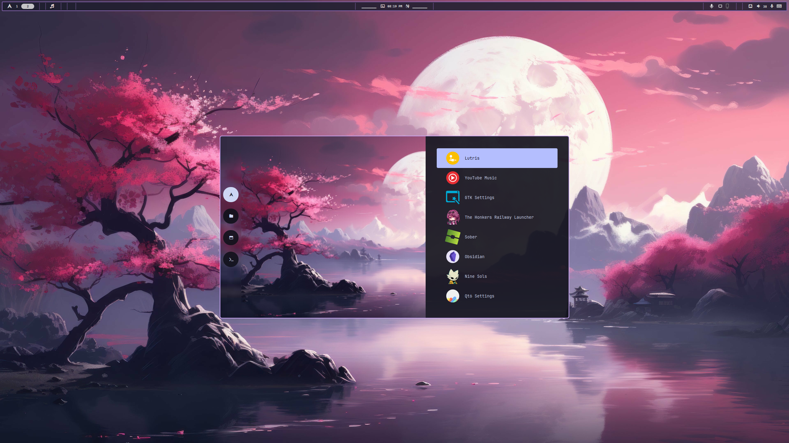

# My linux config files

> [!WARNING]  
> This is very much a work in progress.
> If you have any feedback please do let me know.

#### These are some config files for a pink/purple aestetic on Hyprland. Be sure to check out the important programs section for the programs I use.

## Screenshots

## Important programs

[*Shell*](https://github.com/nushell/nushell)

[*Terminal*](https://github.com/kovidgoyal/kitty) paired with [starship](https://github.com/starship/starship)

[*WM*](https://github.com/hyprwm/Hyprland)

[*Neovim*](https://github.com/neovim/neovim) with [LazyVim](https://github.com/LazyVim/LazyVim)

[*File explorer*](https://github.com/sxyazi/yazi)

## TODO

- [x] Make a somewhat readable README
- [ ] Add a script to install all my linux packages
- [ ] Add a script to install all the programs
- [ ] Add a script to install all the config files
- [ ] Make all of the scripts work from just one install script
- [ ] Make my own version of neovim not reliant on lazyvim  
